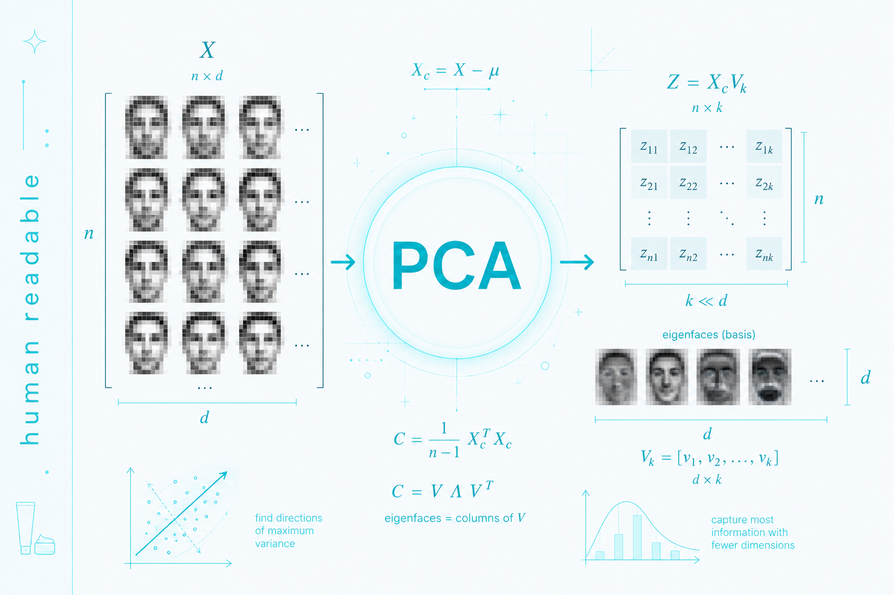

# کاربرد PCA در تشخیص چهره (TESTING)

## مقدمه

تحلیل مؤلفه‌های اصلی (Principal Component Analysis - PCA) یکی از روش‌های مهم کاهش بُعد در یادگیری ماشین و بینایی ماشین است. در مسئله‌ی **تشخیص چهره**، PCA نقش کلیدی در استخراج ویژگی‌های مهم از تصاویر چهره و کاهش پیچیدگی داده‌ها دارد.

---

## ایده اصلی PCA در تشخیص چهره

تصاویر چهره معمولاً داده‌های با ابعاد بسیار بالا هستند (مثلاً یک تصویر 100×100 دارای 10000 ویژگی است). PCA این داده‌ها را به یک فضای با بُعد کمتر تبدیل می‌کند که در آن:

- بیشترین واریانس داده حفظ می‌شود
    
- ویژگی‌های مهم چهره استخراج می‌شوند
    
- نویز و اطلاعات غیرضروری کاهش می‌یابد
    

در حوزه تشخیص چهره، بردارهای ویژه حاصل از PCA به نام **Eigenfaces** شناخته می‌شوند.

---

## مراحل استفاده از PCA در تشخیص چهره

### 1. آماده‌سازی داده‌ها

تمام تصاویر چهره به بردارهای یک‌بعدی تبدیل می‌شوند.

```python
import numpy as np

# فرض: هر تصویر 100x100 است
image = np.random.rand(100, 100)
vector = image.flatten()  # تبدیل به بردار 10000 بعدی
```

---

### 2. ساخت ماتریس داده‌ها

تمام تصاویر در یک ماتریس قرار می‌گیرند.

```python
X = np.array([img.flatten() for img in images])  # (n_samples, n_features)
```

---

### 3. نرمال‌سازی داده‌ها

میانگین داده‌ها از هر نمونه کم می‌شود.

```python
mean_face = np.mean(X, axis=0)
X_centered = X - mean_face
```

---

### 4. اعمال PCA

```python
from sklearn.decomposition import PCA

pca = PCA(n_components=50)  # کاهش بُعد به 50 ویژگی
X_pca = pca.fit_transform(X_centered)
```

---

### 5. استخراج Eigenfaces

بردارهای ویژه PCA به شکل تصاویر قابل نمایش هستند.

```python
import matplotlib.pyplot as plt

eigenfaces = pca.components_

plt.imshow(eigenfaces[0].reshape(100, 100), cmap='gray')
plt.title("Eigenface نمونه")
plt.show()
```

---

## تشخیص چهره با PCA

پس از آموزش مدل، تصویر جدید به فضای PCA تبدیل شده و با داده‌های قبلی مقایسه می‌شود.

```python
def recognize(face_image):
    face_vec = face_image.flatten() - mean_face
    face_pca = pca.transform([face_vec])
    
    # مقایسه با دیتاست (مثلاً nearest neighbor)
    distances = np.linalg.norm(X_pca - face_pca, axis=1)
    return np.argmin(distances)
```

---

## مزایا

- کاهش شدید ابعاد داده
    
- افزایش سرعت پردازش
    
- حذف نویزهای اضافی
    
- مناسب برای سیستم‌های اولیه تشخیص چهره
    

---

## محدودیت‌ها

- حساس به تغییر نور
    
- عملکرد ضعیف در زاویه‌های مختلف چهره
    
- عدم توانایی در مدل‌سازی ویژگی‌های غیرخطی
    

---

## جمع‌بندی

PCA یکی از روش‌های کلاسیک و پایه‌ای در تشخیص چهره است که با تبدیل تصاویر به فضای کم‌بعد Eigenfaces، امکان شناسایی سریع و ساده چهره‌ها را فراهم می‌کند. هرچند روش‌های مدرن‌تر مانند CNN عملکرد بهتری دارند، PCA هنوز برای آموزش مفاهیم پایه و سیستم‌های سبک کاربرد دارد.