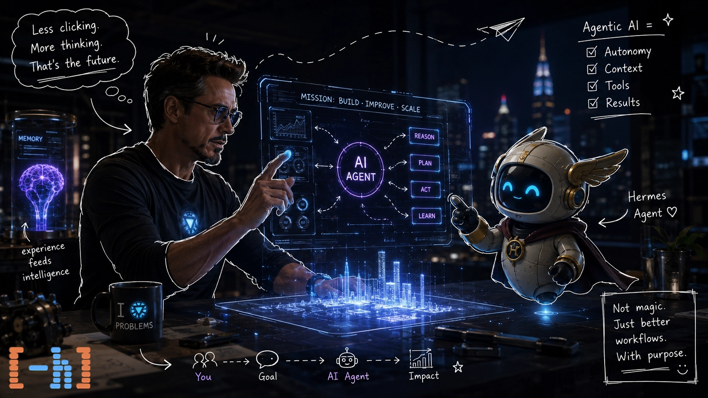
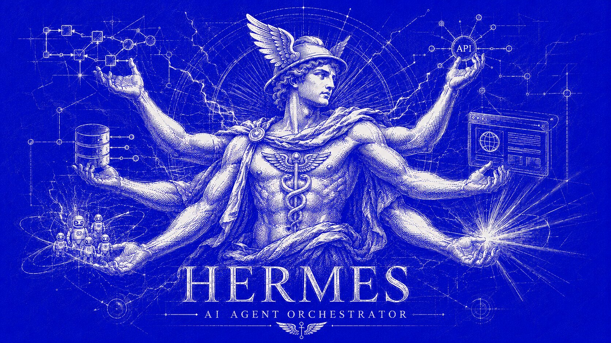

تصور کنید دستیار هوش مصنوعی‌ای دارید. ازش می‌پرسید «آب و هوای تهران چطوره؟» و جواب می‌دهد: «امروز آفتابیه، ۲۸ درجه.» حالا تصور کنید دستیار دیگری هست که وقتی همین سؤال را می‌پرسید، خودش اینترنت را چک می‌کند، دمای امروز و فردا را بررسی می‌کند، نتیجه را در تقویمتان ذخیره می‌کند و اگر باران بیاید، یادتان می‌اندازد که چتر ببرید.

هر دو «هوش مصنوعی» هستند. اما یکی فقط **حرف می‌زند** و دیگری **عمل می‌کند**. به همین تفاوت ساده، `AI Agent` یا «عامل هوش مصنوعی» گفته می‌شود.

## از چت‌بات تا Agent

یک `Large Language Model` یا همان مدل زبانی بزرگ (مثل مدل‌هایی که پشت چت‌بات‌ها هستند) ذاتاً یک پیش‌بینی‌کننده‌ی کلمات است. ورودی می‌گیرد، خروجی تولید می‌کند، تمام. هیچ حافظه‌ای، هیچ اقدامی، هیچ مشاهده‌ای از دنیای بیرون.

اما یک `AI Agent` لایه‌هایی روی این مدل زبانی اضافه می‌کند که آن را از یک «مولد متن» به یک «تصمیم‌گیرنده و عمل‌کننده» تبدیل می‌کند. این لایه‌ها چند مفهوم کلیدی هستند:

### ابزارها (Tools)

یک عامل هوش مصنوعی می‌تواند **ابزارهایی** داشته باشد یعنی توابع یا APIهایی که وقتی لازم باشد فراخوانی می‌کند. مثلاً وقتی بپرسد «ایمیل‌های جدید من چیست؟»، به جای اینکه حدس بزند، واقعاً به سرور ایمیل وصل می‌شود و ایمیل‌ها را می‌خواند.

این ابزار ها مانند بازو های LLM عمل میکنند یعنی AI دیگر نه تنها فقط «می‌داند» بلکه «می‌تواند انجام دهد.» مدل زبانی در اینجا نه به عنوان یک دانشنامه، بلکه به عنوان یک **تصمیم‌گیرنده** عمل می‌کند: «برای این کار بهتر است از ابزار X استفاده کنم.»

### حافظه (Memory)

یک چت‌بات معمولی، مکالمه‌ای که تمام شد را فراموش می‌کند. یک `AI Agent` اما می‌تواند حافظه داشته باشد. دو نوع حافظه:

- **حافظه‌ی کوتاه‌مدت** (`Short-term Memory`): همان زمینه‌ی مکالمه‌ی فعلی. چیزی که یک LLM از قبل می‌فهمد.
- **حافظه‌ی بلندمدت** (`Long-term Memory`): اطلاعاتی که بین جلسات مختلف ذخیره می‌شود. مثلاً «کاربر همیشه نیم‌ساعت قبل از جلسه‌اش یادآوری می‌خواهد.»

با این حافظه، عامل می‌تواند رفتارش را با گذشت زمان شخصی‌سازی کند.

### برنامه‌ریزی (Planning)

شاید مهم‌ترین تفاوت: یک `AI Agent` می‌تواند یک وظیفه‌ی بزرگ را به **چند مرحله‌ی کوچک‌تر** بشکند و آن‌ها را به ترتیب اجرا کند.

مثلاً وقتی بگویید «سفر بعدی من را برنامه‌ریزی کن»، یک چت‌بات فقط یک پاسخ کلی می‌دهد. اما یک Agent:

1. تقویم را چک می‌کند تا ببیند چه روزهایی آزاد است
2. پروازها و هتل‌ها را جستجو می‌کند
3. آب‌وهوای مقصد را بررسی می‌کند
4. بر اساس بودجه و ترجیحات، گزینه‌ها را فیلتر می‌کند
5. یک پیشنهاد نهایی آماده می‌کند

این یعنی AI نه فقط به سؤال شما جواب می‌دهد، بلکه **یک جریان کاری** (`Workflow`) طراحی و اجرا می‌کند.

## حلقه‌ی Perception → Thought → Action

در قلب هر `AI Agent` یک چرخه‌ی ساده وجود دارد:

1. **Perception** (ادراک): محیط را «می‌بیند» — این می‌تواند پیام شما باشد، نتیجه‌ی یک ابزار، یا اطلاعاتی از سنسورها.
2. **Thought** (تفکر): با توجه به آنچه دیده، تصمیم می‌گیرد چه کار بعدی انجام دهد.
3. **Action** (عمل): یک اقدام انجام می‌دهد — صدا بزند، API صدا بزند، پیام بنویسد.
4. این چرخه تکرار می‌شود تا هدف نهایی محقق شود.

به این حالت، `Agentic Loop` یا «حلقه‌ی عاملیت» گفته می‌شود.

## Agentهای چندگانه (Multi-Agent Systems)

یک قدم فراتر: وقتی به جای یک عامل، **چند عامل** با نقش‌های مختلف با هم همکاری کنند.

مثلاً یک «محقق» که اینترنت را می‌گردد، یک «تحلیلگر» که داده‌ها را بررسی می‌کند، و یک «نویسنده» که نتیجه را به زبان ساده تبدیل می‌کند. این سه با هم یک تیم تحقیقاتی خودکار می‌سازند — بدون نیاز به دخالت انسان در وسط کار.

این الگو امروز در ابزارهایی مثل `AutoGPT` و `CrewAI` پیاده‌سازی شده و روز به روز رایج‌تر می‌شود.

## چه کارهایی می‌توانند بکنند؟

امروزه AI Agentها در دنیای واقعی استفاده‌های متنوعی دارند:

- **دستیارهای کدنویسی**: مثل `Cursor` یا `GitHub Copilot` که فقط کد پیشنهاد نمی‌دهند، بلکه می‌توانند یک تسک کامل را خودشان انجام دهند
- **عامل‌های متمرکز بر ترمینال و اتوماسیون (Terminal-first Agents)**: مثل `OpenClaw` که روند انجام کارهای پیچیده در خط فرمان را تسهیل می‌کنند
- **دستیارهای تحقیقاتی**: مقالات جدید را پیدا و خلاصه می‌کنند، داده‌ها را تحلیل می‌کنند
- **مدیریت تقویم و ایمیل**: جلسات را هماهنگ می‌کنند، ایمیل‌های مهم را فیلتر و پاسخ می‌دهند
- **اتوماسیون خانگی**: چراغ‌ها، دما، قفل‌ها — همه با یک دستیار هوشمند که واقعاً کار انجام می‌دهد نه فقط توصیف می‌کند

## نسل بعدی عامل‌ها: آشنایی با Hermes Agent

اگر تا قبل از این، ابزارهایی مثل `OpenClaw` توانسته بودند قدرت اتوماسیون و اجرای دستورات متوالی در ترمینال را نشان دهند، اما نسل جدیدی از عامل‌ها ظهور کرده‌اند که مرز بین «دستور دادن به ماشین» و «همکاری با یک مهندس ارشد» را کلمه‌به‌کلمه کم‌رنگ‌تر می‌کنند. یکی از شگفت‌انگیزترین و قدرتمندترین نمونه‌های این نسل، `Hermes Agent` (توسعه‌داده‌شده توسط Nous Research) است.

### چرا Hermes Agent این‌قدر فوق‌العاده است؟

`Hermes Agent` صرفاً یک چرخه یا Script ساده برای صدا زدن API نیست؛ بلکه یک چارچوب و پلتفرم کامل برای عاملیت هماهنگ است:

1. **معماری مهارت محور (Skills Ecosystem)**:
   در `Hermes Agent` مفهوم مهارت‌ها (Skills) به مرکزیت سیستم تبدیل شده است. عامل می‌تواند مهارت‌های مختلفی را بارگذاری کند، یاد بگیرد و حتی در طول مسیر کار، اگر روش بهتری برای انجام یک کار پیچیده پیدا کرد، آن را به عنوان یک Skill جدید ذخیره کند تا در آینده مجدداً استفاده کند.

2. **حافظه‌ی بلندمدت و هوشمند (Durable Memory)**:
   برعکس عامل‌های سنتی که پس از پایان یک نشست همه‌چیز را فراموش می‌کردند یا با متون طولانی کند می‌شدند، هرمس دارای سیستم حافظه‌ی پایداری است که ترجیحات کاربر، اصلاحات و حقایق کلیدی محیط را بین نشست‌های مختلف نگه می‌دارد.

3. **پشتیبانی از پردازش موازی و ابزارهای چندگانه (Parallel Tool Calls)**:
   هرمس قادر است درخواست‌های مستقل (مثل خواندن چند فایل یا جستجوی همزمان در اینترنت) را در یک مرحله به صورت موازی اجرا کند که سرعت انجام پروژه‌های سنگین را به طرز چشمگیری بالا می‌برد.

### مقایسه سریع: OpenClaw در برابر Hermes Agent

| ویژگی / ابعاد | OpenClaw | Hermes Agent |
| :--- | :--- | :--- |
| **تمرکز اصلی** | اجرای دستورات ترمینال و اتوماسیون وظایف تک‌خطی یا متوالی ساده | همکاری مهندسی عمیق، حل مسائل پیچیده و ساخت فرآیندهای قابل‌تکرار |
| **مدیریت دانش و یادگیری** | اتکا به دستورالعمل‌های ثابت یا Scriptهای پیش‌فرض | سیستم خودکار پویای مهارت‌ها (`Skills`) و قابلیت به‌روزرسانی و ایجاد مهارت جدید |
| **حافظه (Memory)** | محدود به نشست فعلی یا زمینه‌ی متنی پرچمدار | حافظه‌ی بلندمدت پایدار (`Durable Fact Memory`) فیلترشده و هوشمند |
| **عملکرد و سرعت** | چرخه‌ی متوالی تک‌به‌تک (Sequential Loops) | پشتیبانی از صدا زدن همزمان و موازی ابزارها (Parallel Tool Calling) |

به زبان ساده: اگر `OpenClaw` مثل یک آچار فرانسه کاربردی برای اجرای سریع دستورات بود، `Hermes Agent` مثل یک کارگاه کامل با مهندس ارشدی است که کار با تمام ابزارها را بلد است، ترجیحات شما را به یاد می‌آورد و با هر پروژه باتجربه‌تر و هوشمندتر می‌شود.

## محدودیت‌ها

Agentها فوق‌العاده هستند، اما کامل نیستند:

- **Hallucination** همچنان یک مشکل است — یک عامل ممکن است با اطمینان کار اشتباهی انجام دهد
- **هزینه‌ی محاسباتی**: هر چرخه از Perception → Action یک بار فراخوانی مدل است، و این هزینه‌بر است
- **مسئولیت‌پذیری**: وقتی یک Agent خودش تصمیم می‌گیرد و کاری انجام می‌دهد، اگر اشتباه کند، مسئولیت آن با کیست؟

---

آینده‌ی AI Agentها احتمالاً ترکیبی از همه‌ی این‌هاست: چند عامل متخصص که با هم کار می‌کنند، ابزارهای بیشتری دارند، و کمتر اشتباه می‌کنند. شاید روزی برسد که به جای اینکه ما ۲۰ کار مختلف را دستی انجام دهیم، یک تیم از Agentها این کارها را برایمان انجام دهند.

بعضی‌ها از این آینده می‌ترسند. اما شاید بهتر است به جای ترس، بفهمیم دقیقاً چه چیزی داریم می‌سازیم — تا مطمئن شویم کنترلش دست خودمان است.

راستی، همین پست را هم یک Agent نوشت... یا شاید من؟

## رفرنس‌ها

> - https://arxiv.org/abs/2308.11432
> - https://hermes-agent.nousresearch.com/docs
