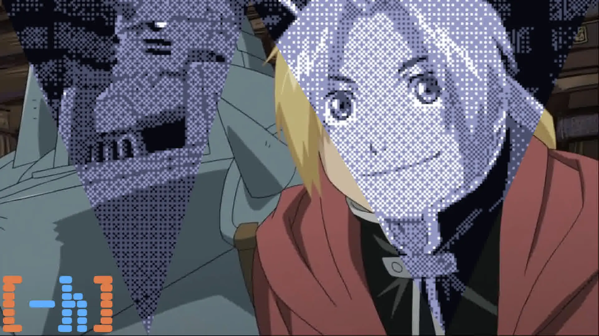
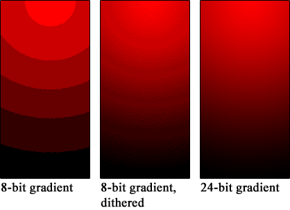
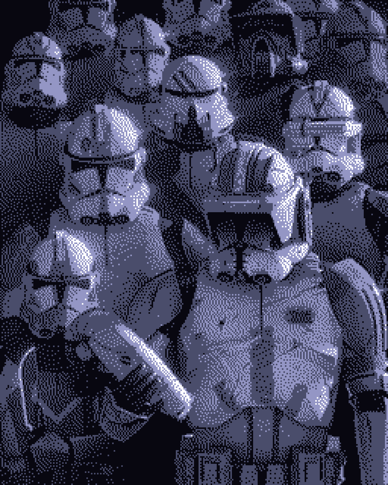
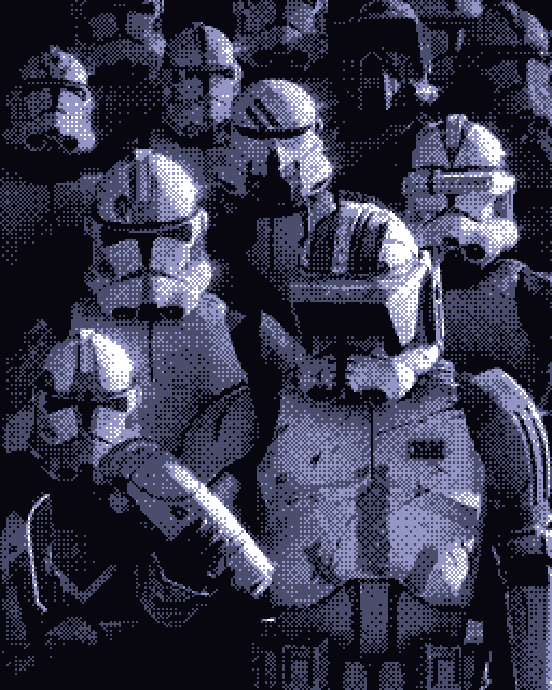

تا به حال به این فکر کرده‌اید که کنسول‌های قدیمی مثل `Game Boy` که نمایشگرهایی با عمق رنگ بسیار پایین داشتند، چگونه توهم تنوع رنگ و سایه‌روشن را در چشم ما ایجاد می‌کردند؟

برای درک این موضوع، یک پرینتر سیاه و سفید خانگی را در نظر بگیرید. این پرینترها `عمق رنگی` برابر با **۱ بیت** دارند؛ یعنی در هر نقطه روی کاغذ یا جوهر می‌ریزند (سیاه) یا نمی‌ریزند (سفید) و ذاتاً چیزی به نام «خاکستری» نمی‌فهمند. اگر یک عکس رنگی را مستقیماً به چنین پرینتری بفرستید، نتیجه یک تصویر خشن با کنتراست‌های به‌شدت بالا و زشت خواهد بود.

برای اینکه این اتفاق نیفتد، باید پیش از پرینت، تنوع رنگ‌های عکس را کاهش دهیم. با استفاده از تکنیک «کوانتیزه کردن» `(Quantization`) یا آستانه‌گذاری، مقادیر پیکسل‌ها را تخمین می‌زنیم؛ پیکسلی که روشن‌تر است و به سفید نزدیک‌تر است را کاملاً سفید در نظر می‌گیریم، و پیکسلی که تاریک‌تر و به مشکی نزدیک‌تر است را کاملاً مشکی می‌کنیم.

اما بعد از این کوانتیزاسیون ساده، متوجه یک مشکل جدی می‌شویم: در تصویر ما مرزهای تند و پله‌پله‌ای شکل می‌گیرد که اصطلاحاً به آن `Color Banding` گفته می‌شود. دیگر خبری از `Gradients` نرم نیست. تصویر زیر مقایسه مقایسه خوبی از یک عکس با عمق 24 بیت و ورژن کوانتیزه شده به 8 بیت و ایجاد color bonding هست:

برای حل این مشکل، یک راه حل بسیار هوشمندانه و جالب پیشنهاد شد: اضافه کردن «نویز کنترل‌شده» به تصویر! این کار باعث می‌شود آن مرزهای خشن از بین بروند.ما در واقع با این الگوریتم، به خطای دیدِ چشم و مغز انسان کلک می‌زنیم. چشم ما به دلیل محدودیت در رزولوشن فضایی، نمی‌تواند نقاط بسیار ریز و مجاور هم را به تفکیک ببیند؛ در نتیجه، ترکیبی از نقاط سیاه و سفید که کنار هم قرار گرفته‌اند را در مغز با هم ترکیب کرده و آن را به صورت یک طیف خاکستری رنگ می‌بیند (به این پدیده `Optical Mixing` می‌گویند).

به این تکنیکِ جذاب **دیترینگ (`Dithering`)** می‌گویند؛ الگوریتمی که دقیقاً برای ایجاد توهمِ عمق رنگیِ بالاتر ساخته شده است. در این روش، خطای ناشی از کوانتیزه شدن دور ریخته نمی‌شود، بلکه مدیریت می‌شود.

## دو دسته الگوریتم اصلی در دنیای Dithering

### الگوریتم های پخش خطا (Error Diffusion)

فرض کنید یک پیکسل خاکستری با مقدار ۶۰ درصد داریم. وقتی آن را کوانتیزه می‌کنیم و به مشکی مطلق (۱۰۰٪) تبدیل می‌کنیم، در واقع ۴۰ درصد «خطای ریاضی» ایجاد کرده‌ایم. 
در روشی به نام پخش خطا (که معروف‌ترین الگوریتم آن **[Floyd-Steinberg](https://en.wikipedia.org/wiki/Floyd%E2%80%93Steinberg_dithering)** است)، این خطای ۴۰ درصدی محاسبه شده و به پیکسل‌های همسایه که هنوز پردازش نشده‌اند، سرریز (`Diffuse`) می‌شود. این کار باعث می‌شود اگر یک ناحیه کمی روشن‌تر از مشکی مطلق است، چند پیکسل سفید در میان پیکسل‌های مشکیِ اطرافش پخش شود تا میانگین رنگیِ آن ناحیه حفظ شود.

اما در الگوریتم پخش خطا، پردازنده مجبور است صبر کند تا پردازش یک پیکسل تمام شود، خطای آن را حساب کند و بعد آن خطا را به پیکسل‌های بعدی منتقل کند. برای کنسول‌هایی مثل Game Boy یا کامپیوترهای دهه ۸۰ و ۹۰ میلادی که رم و توان پردازشی بسیار محدودی داشتند، انجام این پردازشِ پی‌در‌پی `Real-time` تقریباً غیرممکن بود. اینجا بود که روشی سریع‌تر، سبک‌تر و البته هنری‌تر ابداع شد : **`Ordered Dithering`**.

### دیترینگ منظم و حس نوستالژی (Ordered Dithering)

علاوه بر پخش خطا، روش دیگری به نام **`Ordered Dithering`** وجود دارد که راز اصلی گرافیک‌های رترو و کنسول‌هایی مثل `Game Boy` است. در این روش به جای پخش کردن خطای محاسباتی، از یک ماتریس ریاضی (مثل ماتریس بایر - `Bayer Matrix`) استفاده می‌شود تا نقاط روشن و تاریک با الگوهای شطرنجی و هندسیِ بسیار منظمی کنار هم چیده شوند.

هرچه نقاط مشکی در این الگوی شطرنجی متراکم‌تر باشند، مغز شما آن ناحیه را تاریک‌تر می‌بیند. این تکنیک نه‌تنها بار پردازشی بسیار کمی برای پردازنده‌های ضعیفِ دهه‌های گذشته داشت، بلکه استایل بصریِ پیکسلی و بی‌نظیری خلق کرد که امروزه به عنوان یک سبک هنری (`Pixel Art`) شناخته می‌شود.

در نهایت، Dithering شاهکارِ ترکیب ریاضیات و بیولوژی انسان است. تکنیکی که نشان می‌دهد گاهی اوقات برای رسیدن به یک تصویر بی‌نقص، کافیست کمی «نویز»ِ هوشمندانه به آن اضافه کنیم! راستی این تکنیک حتی داخل پردازش صدا هم استفاده میشه...

## کد و رفرنس ها
> https://en.wikipedia.org/wiki/Dither 
> https://github.com/CS-Astronaut/Pixelated-Dreams/tree/main/dithering
