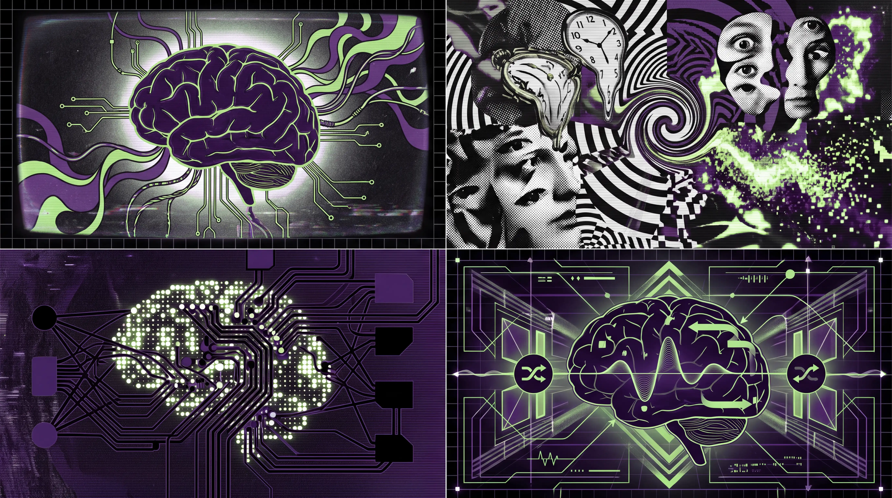

تا به حال شده شب از خواب بیدار شوید و با خودتان فکر کنید: *«این چه خواب عجیب و بی‌ربطی بود که دیدم؟»* 
مثلاً خانه‌ی دوران کودکیتان را می‌بینید که در آن همکاران فعلی‌تان دارند در وسط اتاق پذیرایی سوار یک قایق  می‌شوند! رویاها غالباً سورئال، عجیب و پر از نویز هستند. اما چرا تکامل باید چنین سیستم پیچیده‌ای طراحی کند تا هر شب داستان‌های بی‌معنی و عجیب در ذهن ما پخش کند؟

اگر اهل یادگیری ماشین (`Machine Learning`) باشید، حتماً با کابوسی به نام **بیش‌برازش (`Overfitting`)** آشنا هستید. وقتی یک مدل هوش مصنوعی را بیش از حد روی داده‌های تکراری، محدود و روزمره آموزش می‌دهیم، مدل شروع به «حفظ کردن» جزئیات بی‌اهمیت داده‌ها می‌کند و قدرت **تعمیم‌دهی (`Generalization`)** خود را در برابر داده‌های جدید از دست می‌دهد.

چند سال پیش، یک فرضیه فوق‌العاده جذاب در دنیای علوم اعصاب مطرح شد که ارتباط مستقیمی با یادگیری ماشین دارد: **فرضیه مغز بیش‌برازش‌شده (`Overfitted Brain Hypothesis`)**. طبق این فرضیه، مغز ما دقیقاً برای جلوگیری از بیش‌برازش در زندگی روزمره، خواب می‌بیند!

## وقتی مغز روزها در حال Overfit شدن است

در طول روز، مغز ما حجم عظیمی از ورودی‌های تکراری و متوالی را پردازش می‌کند. مسیر رفت و آمد به خانه، فرمت ایمیل‌ها، چهره افراد و کارهای روتین. اگر مغز صرفاً این داده‌های تکراری را بدون هیچ تغییری جذب کند، شبکه‌های عصبی زیستی ما کم‌کم دچار بیش‌برازش می‌شوند. در این حالت، مغز در مواجهه با شرایط غیرمنتظره یا تغییرات ناگهانی محیط، عملکرد بهینه‌ای نخواهد داشت زیرا داده‌های قبلی را زیاده از حد حفظ کرده است.

در مهندسی هوش مصنوعی، وقتی شبکه‌های عصبی عمیق (`Deep Neural Networks`) روی یک Dataset خسته‌کننده و تکراری گیر می‌افتند، الگوریتم‌ها دچار رکود می‌شوند. برای حل این مشکل، مهندسان هوش مصنوعی تکنیک‌های مختلفی را ابداع کرده‌اند:

1. **تزریق نویز (`Noise Injection`)**: افزودن داده‌های تصادفی برای خاموش کردن مسیرهای حفظ‌شده.
2. **دستکاری داده‌ها (`Data Augmentation`)**: چرخش، تغییر رنگ یا تغییر شکل تصاویر ورودی تا مدل یاد بگیرد مفهوم کلی را بفهمد نه فرمت دقیق را.
3. **قطعی تصادفی نورون‌ها (`Dropout`)**: خاموش کردن بخشی از نورون‌ها در هر دور آموزش تا بقیه نورون‌ها متکی به آن‌ها نشوند.

حالا سوال اصلی این است: **آیا طبیعت میلیون‌ها سال قبل از ما این تکنیک‌ها را ابداع نکرده بود؟**

## خواب و REM: تکنیک Data Augmentation طبیعی

اریک هوئل (`Erik Hoel`)، دانشمند علوم اعصاب و نویسنده، پیشنهاد کرد که رویاها (به‌ویژه در مرحله خواب `REM`) همان نویز کنترل‌شده یا داده‌های دستکاری‌شده‌ای (`Augmented Data`) هستند که مغز به خودش تزریق می‌کند.

در طول مرحله `REM Sleep`، مغز ورودی‌های حسی واقعی (مثل نور، صدا و لمس) را قطع می‌کند، اما سطح فعالیت نورون‌ها به‌شدت بالا می‌رود. مغز شروع به بازسازی، ترکیب و شبیه‌سازی صحنه‌های عجیبی می‌کند که نسخه دستکاری‌شده و نویزی از خاطرات و تجربه‌های روزهای گذشته هستند.

تصویری که در رویا می‌بینید، هرچند عجیب است، اما ویژگی‌های بنیادی دنیای واقعی را دارد. این دقیقاً مانند این است که یک مدل بینایی ماشین را با تصاویر تار، بچرخیده یا دارای نویز آموزش دهید تا در شرایط نوری و زاویه‌ای مختلف سقوط نکند. خواب با ارائه سناریوهای سورئال، میانبرهای حافظه مغز را می‌شکند و قدرت تعمیم‌دهی ذهنی ما را بالا نگه می‌دارد.

## شباهت تکنیک‌های Machine Learning و مکانیزم رویا

اگر بخواهیم تکنیک‌های جلوگیری از Overfitting در مدل‌های عمیق را با آنچه در مغز هنگام خواب اتفاق می‌افتد مقایسه کنیم، به شباهت‌های شگفت‌انگیزی می‌رسیم:

| تکنیک در Machine Learning | معادل آن در علوم اعصاب و خواب | کارکرد و هدف اصلی |
| :--- | :--- | :--- |
| **Data Augmentation** | رویاهای عجیب و ترکیب خاطرات | تغییر فرمت داده‌ها برای جلوگیری از حفظ کردن جزئیات تکراری |
| **Noise Injection** | فعال‌سازی تصادفی نورون‌ها در مرحله REM | شکستن الگوهای صلب و یکنواخت در شبکه‌های عصبی |
| **Dropout** | سرکوب برخی انتقال‌دهنده‌های عصبی (مثل نورآدرنالین) | خاموش کردن بخش‌هایی از مغز برای بازسازی مسیرهای جدید |
| **Regularization** | تثبیت و هرس سیناپسی (`Synaptic Pruning`) | جریمه کردن وزن‌های اضافه و ساده‌سازی مدل ذهنی |

## چرا خواب‌های ما این‌قدر بی‌منطق هستند؟

اگر رویاها خیلی منطقی و شبیه به زندگی واقعی بودند، مغز باز هم در حال تمرین روی همان داده‌های روزمره بود و فرآیند تعمیم‌دهی اتفاق نمی‌افتاد. برای اینکه شبکه عصبی مغز از «مینیمم‌های محلی» (`Local Minima`) خارج شود، نیاز به جهش‌های بزرگ و شوک‌های نویزی دارد. 

به همین دلیل است که وقتی در زندگی دچار استرس، تغییر شغل، یا تجربه جدیدی می‌شویم، خواب‌های ما عجیب‌تر و مشوش‌تر می‌شوند. مغز در حال تلاش برای هضم داده‌های جدید و تنوع بخشیدن به سناریوهای شبیه‌سازی‌شده است تا مدل ذهنی شما در برابر تغییرات آینده شکسته نشود.

در نهایت، خواب دیدن نشان‌دهنده نقص مغز یا پردازش بی‌هدف اطلاعات نیست؛ بلکه شاهکار تکامل برای به‌روز نگه داشتن و انعطاف‌پذیری شبکه‌های عصبی ماست. شاید دفعه بعدی که خواب عجیبی دیدید، بد نباشد از سیستم آموزش شبانه مغزتان برای تزریق نویز و جلوگیری از Overfitting تشکر کنید!

## کد و رفرنس ها

> - https://www.cell.com/patterns/fulltext/S2666-3899(21)00064-7
> - https://en.wikipedia.org/wiki/Overfitting
> - https://arxiv.org/abs/2007.09560
